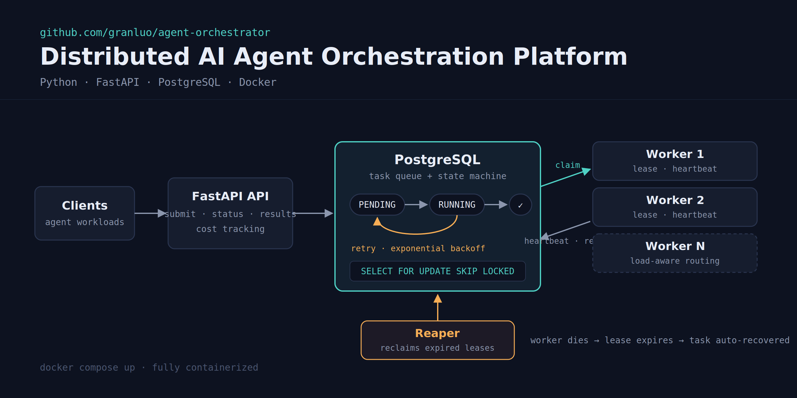

# Agent Orchestrator



A durable, multi-worker task orchestration platform built on PostgreSQL.
Tasks are submitted over HTTP, persisted in Postgres, and executed by workers
that claim work concurrently. The worker can route prompts to local or cloud
Ollama models, records execution cost and duration, and exposes operational
metrics through the API.

The design bet is that **Postgres is the coordinator**. Claiming,
deduplication, crash recovery, and poison-task protection are all expressed as
SQL against a single `tasks` table using row locks, constraints, leases, and
bounded counters. No Redis, no message broker, no separate lock service.

## Features

- **Durable state machine**: task state (`PENDING`, `RUNNING`, `SUCCEEDED`,
  `FAILED`) lives in Postgres, so a process crash does not lose queued work.
- **Concurrent claiming**: workers use `SELECT ... FOR UPDATE SKIP LOCKED` to
  fan out across pending tasks without claiming the same row.
- **Idempotent submission**: the optional `Idempotency-Key` header deduplicates
  retried submissions via a unique constraint and `ON CONFLICT`.
- **Retries with exponential backoff**: transient execution failures are
  retried up to `retry.max_retry`, using `2 ** retry_count` seconds of backoff.
- **Crash recovery**: running tasks hold a lease renewed by a heartbeat thread;
  the reaper returns stale `RUNNING` tasks to `PENDING`.
- **Poison-task protection**: `delivery_count` limits how many times a task can
  be handed to workers, even if workers keep crashing mid-task.
- **Adaptive routing**: workers choose `local` or `cloud` execution based on
  prompt length and queue depth, then persist the selected route.
- **Cost and duration metrics**: completed tasks store backend cost and
  execution duration; `/metrics` summarizes queue state, retries, reclaimed
  work, duration, and cost by route.

## Stack

- Python
- FastAPI
- PostgreSQL
- psycopg2
- Ollama-compatible generation API
- TOML configuration

## Project Layout

| Path | Responsibility |
| --- | --- |
| `main.py` | FastAPI app with task submission, task lookup, and metrics endpoints |
| `scheduler.py` | Worker loop: reclaim stale work, claim, route, execute, heartbeat, retry |
| `db.py` | Postgres connection handling, task submission, status lookup, metrics queries |
| `config.py` | Loads runtime settings from `config.toml` |
| `config.toml` | Retry limits, routing thresholds, model names, cost rates, Ollama URL |
| `schema.sql` | `tasks` table and hot-path index definition |
| `DESIGN.md` | Architecture notes and design tradeoffs |
| `DEBUGGING_NOTES.md` | Debugging record for concurrency and timing issues |
| `docs/architecture.png` | Architecture diagram |

## Configuration

Connection parameters are hardcoded for local development; the password comes from the DB_PASSWORD env var (defaults to devpass) — secrets stay out of code and config files.

- Host: `localhost`
- Port: `5432`
- Database: `orchestrator`
- User: `postgres`
- Password: `DB_PASSWORD`, defaulting to `devpass`

Application settings live in `config.toml`:

```toml
[retry]
max_retry = 3
max_delivery = 3

[routing]
prompt_threshold = 100
pending_threshold = 5

[models]
local = "llama3.2:latest"
cloud = "qwen3:14b"

[cost]
local_per_token = "0.00001"
cloud_per_token = "0.0001"

[ollama]
url = "http://localhost:11434"
timeout_seconds = 60
```

Routing rules:

- Prompts longer than `routing.prompt_threshold` use the `cloud` model.
- If pending queue depth is above `routing.pending_threshold`, new work uses
  the `cloud` model.
- Otherwise, work uses the `local` model.

## Quick Start


Start Postgres (schema is created automatically on first run):

```bash
docker compose up -d
```

Make sure Ollama is running and the configured models are available:

```bash
ollama pull llama3.2:latest
ollama pull qwen3:14b
```

Install Python dependencies in your preferred environment:

```bash
pip install -r requirements.txt
```

Start the API:

```bash
uvicorn main:app --reload
```

Start a worker in another shell:

```bash
python scheduler.py
```

Submit a task:

```bash
curl -X POST http://localhost:8000/tasks \
  -H "Idempotency-Key: demo-1" \
  -H "Content-Type: application/json" \
  -d '{"prompt": "Write one sentence about durable queues."}'
```

Check task status:

```bash
curl http://localhost:8000/tasks/1
```

Check metrics:

```bash
curl http://localhost:8000/metrics
```

## Tests

```bash
python -m pytest
```

Unit tests cover `decide_route` — both routing signals, threshold boundaries, and defensive handling of missing keys.

## API

### `POST /tasks`

Submits a prompt task.

Request body:

```json
{
  "prompt": "hello"
}
```

Optional header:

```http
Idempotency-Key: demo-1
```

Response:

```json
{
  "task_id": 1,
  "status": "PENDING"
}
```

### `GET /tasks/{task_id}`

Returns task status and result when available.

Response:

```json
{
  "task_id": 1,
  "status": "SUCCEEDED",
  "result": {
    "text": "..."
  }
}
```

Missing tasks currently return:

```json
{
  "error": "not found"
}
```

### `GET /metrics`

Returns aggregate operational metrics.

Example shape:

```json
{
  "by_status": {
    "PENDING": 2,
    "SUCCEEDED": 10
  },
  "avg_retry": 0.2,
  "reclaimed_count": 1,
  "avg_duration_seconds": 3.41,
  "cost_by_route": {
    "local": "0.15818000",
    "cloud": "0.03400000"
  }
}
```

## Crash-Recovery Demo

```bash
./demo.sh
```
The script submits a long task, kills the worker mid-execution (SIGKILL), waits for the lease to expire (~35s), starts a fresh worker, and shows the final state: `delivery_count=2, retry_count=0` — the task was delivered twice but never failed. A worker crash is redelivery, not task failure.

### What it does under the hood

1. Submit a task that takes long enough to run through the worker.
2. Kill the worker process while the task is `RUNNING`.
3. Watch the heartbeat stop renewing `lease_expires_at`.
4. After the lease expires, the reaper returns the task to `PENDING`.
5. Start a fresh worker and confirm it reclaims and completes the task.

This demonstrates the lease + heartbeat + reaper recovery loop. The system is
at-least-once: a recovered task may execute again, so task effects should be
idempotent when the execution side effect matters.

## Design Notes

Read [DESIGN.md](./DESIGN.md) for the deeper architecture discussion:

- why Postgres is used as the coordinator,
- how `SKIP LOCKED` enables concurrent workers,
- how idempotency is enforced,
- why `retry_count` and `delivery_count` are separate,
- how leases and heartbeats recover crashed workers,
- and what limitations remain in this iteration.

